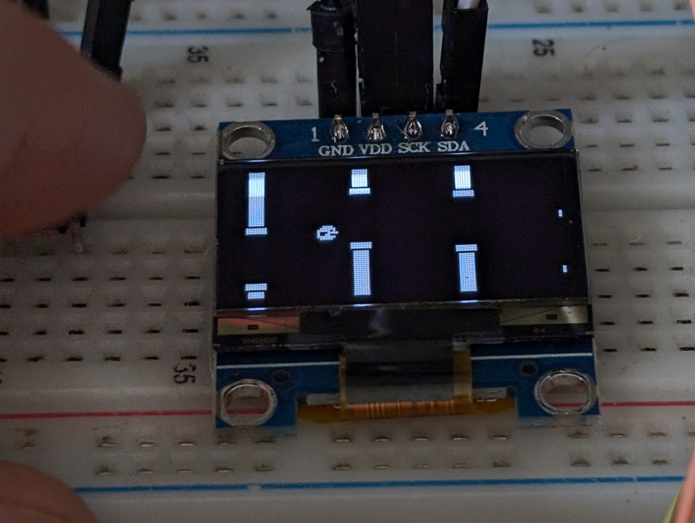

# Flappy bird on a Pi Pico

Flappy bird on a Pi Pico 2 written in C, with the goal of writing it in ARM assembly in the future. Uses an SSD1306 display and doesn't use any libraries other than the Pico SDK.

Here's a [link to the demo video](assets/demo-video.mp4).

Almost anything you'd want to customise is in `src/defs.h`

Features:

- Animated bird
- Auto restart 2.5 seconds after dying
- No score keeping for now (it's fairly easy to implement; the hard bit is displaying the score)

## Pinout

| Pi Pico pin | Connected to |
| ------------|--------------|
| GPIO 4      | SSD1306: SDA |
| GPIO 5      | SSD1306: SCL |
| 3.3V        | SSD1306      |
| GND         | SSD1306      |
| GND         | PTM switch   |
| GPIO 6      | PTM switch   |

The switch is pulled up internally using the internal pullups of the Pico. I initially tried using the internal pulldowns, they didn't work (maybe I didn't read a bit of the datasheet or maybe my Pico is a little broken).

~~Also, I'd recommend placing a 100nF cap between GPIO6 and GND for debouncing.~~
Edit: bad idea, all it does is prevent some inputs from registering. Don't use a capacitor, unless it's a really small one.

---

This was made as a [Summer of Making](https://summer.hackclub.com) project, you can [view my project page here](https://summer.hackclub.com/projects/2181) (you need to be logged in).
